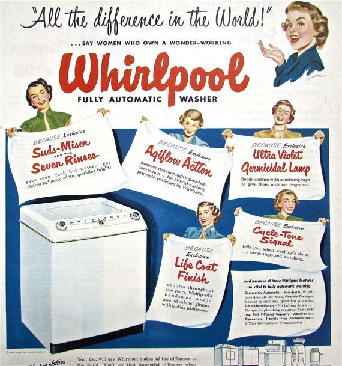
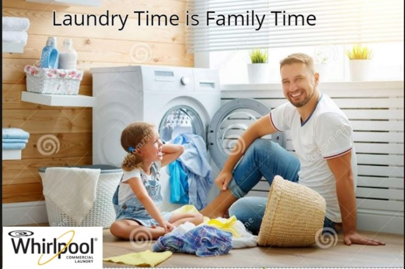
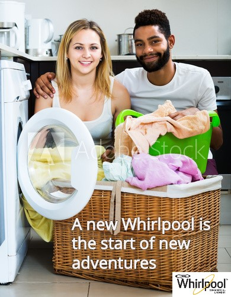
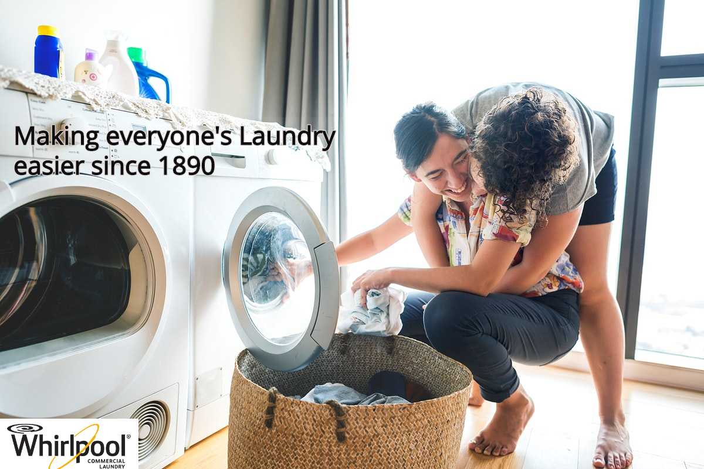

# Welcome to Todd Schaffer's Dice Final Project Homepage
# Introduction
In today’s world of marketing advertisement, there are many stereotypes that display certain gender roles in common household appliances. For a man, they will be usually depicted in advertisements using some variety of home construction tools or usually entering the home from work in a business suit. For a woman, they are typically depicted as someone who is performing chores around the house. Usually those household chores involve cleaning the house, doing the laundry and taking care of the children. In the 20th century this stereotype was somewhat accurate because women did not have nearly the same opportunities that they have today in the 21st century. Men in the 20th century were also stereotypical of what you saw in the advertisements because they were usually the “bread winners” of the household but, todays times are not the same as they were in the 1950’s. Women have been breaking through the glass ceiling of gender stereotypes and are empowering the way they are viewed today. Men are also challenging the normalized thought of who could be the stay-at-home parent by taking on more roles in cooking, cleaning and other household tasks. Advertising in the 21st century has not accurately depicted these changes in gender role stereotypes and they should now be adapted to more correctly show how anyone, including same sex parents, can perform different tasks and roles around the household. The newly adapted advertisement presented is going to showcase households with same sex households, interracial households, extended family households so that they can really depict the diversity of everyone that uses laundry appliances.

# Why I Chose Whirlpool?

The selected advertising text print I chose I believe accurately showcases the common stereotype that the Whirlpool brand tried to depict. A common white woman that all have similar hairstyles and no apparent physical differences. The caption at the top of the Whirlpool advertisement even states that, “All the difference in the World!...say women who own a wonder-working Whirlpool Fully Automatic Washer.” I am adapting this current advertisement because I believe that it does not showcase enough diversity of who benefits or variety of people who use a Whirlpool washing machine. This marketing advertisement only portrays white women without any visible dissimilarities between any of them. This advertisement could be improved by adding men, the elderly and other cultural groups who use the Whirlpool washing machines. Many different groups of people have become marginalized in society’s depiction of who does laundry. A new Whirlpool advertisement can challenge this assertion because the vast majority of all people use laundry machines.

# Historical Context
In the academic journal article, Female Stereotypes in Print Advertising: A Retrospective Analysis, Yorgos C. Zotos and Eirini Tsichla talk about how in the early to mid-20th century women in advertisements were depicted as “unrealistic and limited; pictures of women as sex objects, “happy housewives” themes of females as incompetent, portrayals of womens’ dependency upon men; and underrepresentation of working women.” (446). In an article by KQED Arts by Rae Alexandra, she stated when talking about 20th century laundry ads, “In the 1950s, one angle employed to encourage housewifery was to convince women that there was glamor to be found in drudgery…laundry was presented as a complex and scientific task, well-suited to glasses-wearing, pointer-wielding smartypants who knew all about "cycletron programming" and "complete agitation." The historical and cultural significance of these advertisements were to advertise the talent women would gain by learning how to operate a laundry machine. Even though this was the stated motive behind major laundry machine manufacturers advertisements, it really was a way Zotos and Tsichla stated that portrayed women dependent upon men. These advertisements were a subliminal way to depict where women should be and what work they should be doing. None of these advertisements depicted a man doing the family’s laundry which further enforced the gender stereotype for nearly a century long.

# The Adapation

I thought this new Whirlpool print text advertisement was a good representation of how Dads can be stay-at-home parent but, also someone who can do the laundry just as well as the mom. I also liked creating this advertisement because it showcases that being a man and doing laundry doesn’t have to seem like a chore or demeaning. It can be something fun that a dad can teach and perform with the children which is why I used the caption, “Laundry Time is Family Time.” I tried to break the mundane normative stereotype of laundry roles.

This ad has adaptation that is most closely associated with commentary. At face value, it is just of a man and woman but, it more subtly portrays how households are not just of the same cultural make-up. It can be of a man or woman of opposite ethic backgrounds which live under the same house. The caption above hints that Whirlpool is for new adventures which also showcases the younger age of families who use Whirlpool products. I also portrayed a household without any children because not all household have children in them.

The last advertisement I chose to depict on a new Whirlpool print text ad is of a gay couple. Now that same sex marriages are federally legal, there is no excuse for Whirlpool to not showcase how diverse households are today. In the caption I wrote, “Making everyone’s Laundry easier since 1890.” I chose this caption to pay homage to the long history of Whirlpool and the inclusive word of everyone to portray how accepting Whirlpool is of all types of households. I think it is important to show the year it was founded so it could show everyone seeing it that even though the company has been around for a long time, it adapts to diversity changes in the world.
# Formal Qualities 
When creating the new adaptions of a gender-neutral Whirlpool Washing machine advertisement, it was important to consider universal design. Universal design is extremely important in the 21st century because it is all inclusive for everyone to read and understand the text. The typeface formal quality that I chose to use in the creation of the advertisement was Open Sans. This typeface is easier to read for all people and it is more inclusive for everyone. In the original advertisement, it used a cursive typeface in most if not all the text. The use of this typeface made it hard to read what the advertisement said, and it would not be applicable to use today. The other formal quality that I used was tone and color. Laundry is something that needs to be seen as very bright and airy. It often portrays the emotional feeling of cleanliness. The bright tone of the picture combined with the solid white of the appliances give off the emotional cue of polished quality. The first advertisement incorporates some of these visual tones but, they do not have the rendering capabilities to adjust to the brighter tone that can be created. This newer rendition brings a more modern feeling to the Whirlpool brand.
# Cultural Meaning
In the cultural meaning of past advertisements, it can best be explained by philosopher and social theorist, Michel Foucault. Michel Foucault’s theory of social constructionism is what can help explain why advertisements are portrayed the way they are. Social constructionism is a theory of knowledge in sociology and communication theory that examines the development of jointly constructed understandings of the world that form the basis for shared assumptions about reality. These shared assumptions about reality can further be enforced by the different text that are often depicted in the same bias framework. For example, in the Whirlpool advertisement, it assumes that women are the only ones who doe laundry in the households. Also, in the Whirlpool advertisement, it connotes that white women are the only race of women that can afford its products. Whirlpool’s advertisement does not show the diverse population of people who use its products. Michel Foucault would argue that this is a form of a quark or institutional fact, which is a strong social construct that rely on the human perspective and knowledge that does not just exist but is rather constructed by society. This constant framework of stereotypical advertisements can have detrimental social hindrance that affect the way society see women and the “normal” household.  
# Rhetorical Significance 
The new rendered marketing Whirlpool advertisement adaptation addresses the inclusive view of all households. Its purpose is to show the diversity of all different households and it does not play favoritism to one group. It is important to show that previous marginalized groups are being seen equal as all other households in the world. This advertisement is trying to persuade conservative groups that the rhetoric has changed from the 1950’s. It makes the case that men can perform the same laundry tasks as women, households can come from combined ethic make-ups and same sex couples all use laundry as any other family would. It is important to break the status quo of how common households are seen in appliance advertisements. All households perform the same chores around the house and they are no real differences between any of the different household make-ups. The consequence of this advertisement is to begin to break the mold of an older mindset that a family must look a certain way. It is supposed to show that these different households all have much more similarities. This advertisement is to show unity in the world that we can all accept each other, and gender stereotypes are no longer a current to today’s time.
# Reflection
As a soon to be Seattle University graduate who majored in marketing, I think it is important to change the way advertising is done. I believe it is important to show more diversity and inclusion of everyone. Spending four years looking at constant case studies and marketing advertisements, I realized that there is a common rhetoric that white families and gender stereotypes are always shown. There is less of a focus on showing the growing diversity that continues in America. Even when I was looking for pictures of men doing laundry, there was often a depiction of them looking confused and frustrated. Advertisements often intensify the gender stereotype that they believe Americans have but, I do not believe that is the mindset we all have. We are being programmed by advertisements to see and think a certain way about certain roles in society. As a future marketer, I want to challenge these roles and push a new mindset that is more inclusive and diverse.
# Work Cited
1. Internet Encyclopedia of Philosophy, www.iep.utm.edu/foucault/. 

2. Alexandra, Rae. “The Extraordinarily Sexist History of Laundry Detergent Commercials.” KQED, 6 Feb. 2018, www.kqed.org/pop/101669/the-extraordinarily-sexist-history-of-laundry-detergent-commercials. 

3. Wang, Joan. “Race, Gender, and Laundry Work: The Roles of Chinese Laundrymen and American Women in the United States, 1850-1950.” Journal of American Ethnic History, Nov. 2014.

4. Zotos, Yorgos C, and Eirini Tsichla. “Female Stereotypes in Print Advertising: A Retrospective Analysis.” Procedia - Social and Behavioral Sciences, vol. 148, 25 Aug. 2014.
